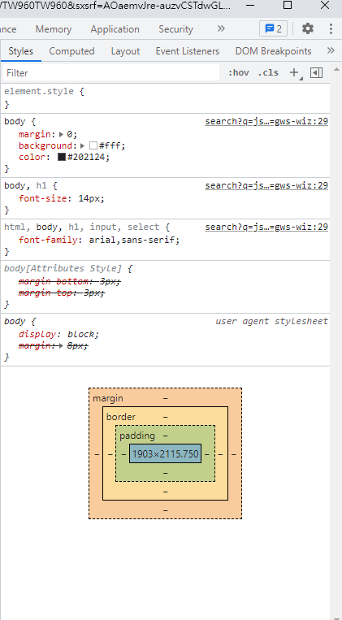

# 問題解決

## 1.

SCSS 切版跑版
[Doc](https://wcc723.github.io/css/2017/07/21/css-flex/)

## 2.

路由控制
假如你要寫 SPA，可以使用 React Router 來控制
使用 Route 來渲染 component

```
 <Switch>
        <Route path="/" exact>
          <Homepage />
        </Route>
        <Route path="/business" exact>
          <BusinessPage />
        </Route>
      </Switch>
```

## 3.

查看 clone project styling
[Google Dev Tool](https://developer.chrome.com/docs/devtools/css/)
使用 google dev tool，來查看 style


## 4.

API 串接
axios 回傳的物件是 Promise(fulfilled 狀態)，所以我們可以用.then 和.catch 去處理成功和失敗結果
axios 默認是 GET 請求，也可以直接用 axio 內建好的請求方法，例如是.get 和.post

```
  const [cardItems, setCardItems] = useState([]);

  useEffect(() => {
    const fetchCardItem = async (req, res) => {
      const apiUrl = "https://midterm-dbapi-1101.herokuapp.com/api/category2";
      const { data } = await axios.get(apiUrl);
      setCardItems(data);
    };
    fetchCardItem();
  }, []);
```

## 5.

如何寫 Component

```
import React from "react";
import '../styles/businessCard.scss'

export default function BusinessCard({
  imgUrl,
  title,
  content,
  buttonContent,
}) {
  return (
    <div className="business__card">
      <div className="business__card--imgBox">
        
      </div>
      <div className="business__card--description">
        <div className="business__card--title">
          <h1>{title}</h1>
        </div>
        <div className="business__card--content">
          <p>{content}</p>
        </div>
        <div className="business__card--buttonContent">
          <a href="/#">{buttonContent}</a>
        </div>
      </div>
    </div>
  );
}
```
